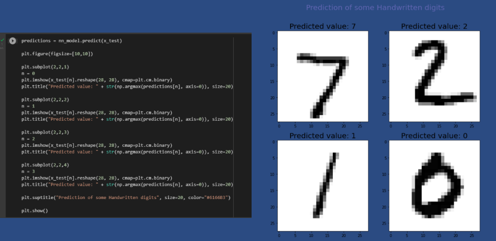

# <h1 align="center">Classification-ANN 

## Used Classification (ANN) For Churn Dataset
# :1234:

#### A) FOR THE CHURN MODELLİNG DATASET USE ARTİFİCİAL NEURAL NETWORKS TO PERFORM CLASSİFİCATİON AND SHOW  İTS ACCURACY. 

#### B) DRAW THE NEURAL NETWORK ARCHİTECTURE YOU HAVE USED.

